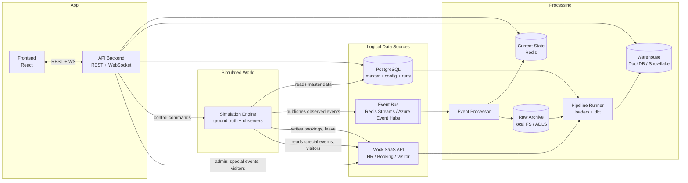

# Architecture

> Smart Workplace / Office Digital Twin Simulator
> Status: DRAFT v0.2. Source of requirements: `docs/SPEC.md` (section 51 overrides earlier sections).
> Related docs: `event-model.md`, `data-model.md`, `simulation-engine.md`, `live-streaming.md`, `visualization-spec.md`, `simulation-scenarios.md`, `implementation-plan.md`, `cloud-migration.md`

> **Current scope: everything runs locally.** Redis Streams, local raw archive, DuckDB and the mock SaaS stand in for Azure Event Hubs, ADLS, Snowflake and real enterprise systems. All cloud work is deferred and designed in `cloud-migration.md`; the adapter interfaces in §6 are what make the later move a configuration change.

---

## 1. Purpose

This document defines the system components, their responsibilities, how data flows between them, and which infrastructure choices are local vs cloud.

The architecture is built around one idea: **a discrete-event simulation of a workplace produces a ground-truth world, and every "data source" is an observer of that world.** Everything downstream (current state, dashboards, digital twin, warehouse, analytics, automation) consumes only the observed data, exactly as it would in a real deployment with physical sensors and enterprise systems.

---

## 2. Architectural Principles

- **Engine owns the world.** The simulation engine is the only producer of synthetic operational data. No other component generates random data.
- **Ground truth is separate from observation.** The engine keeps the true state of every person. Observers derive source-specific events from it with realistic lag, noise, and failure.
- **Identity boundary.** Identity only enters through identity-aware sources (access control, workstation login, HR, booking, visitor systems). Anonymous sensor events never carry, reference, or correlate to a person.
- **Replaceable infrastructure.** Every infrastructure dependency sits behind an interface. Local implementations ship first; cloud adapters (Azure, Snowflake) are added later without changing callers.
- **Local-first.** `docker compose up` gives a fully working system with no cloud credentials.
- **Event history and current state are separate.** History is append-only (raw archive, warehouse). Current state is maintained incrementally by the event processor and never recomputed from full history.
- **Reproducibility.** Same configuration + same seed yields the same ground truth and the same observed events, in both live and batch modes.
- **Sim time vs wall time.** All business timestamps are simulated time. Wall-clock time is used only for operational monitoring (pipeline latency, processing time).

---

## 3. System Context



---

## 4. Components

### 4.1 Simulation Engine (`services/simulation-engine`)

**Responsibility:** simulate the workplace and emit observed events.

- Simulated clock (scaled realtime for live runs, virtual clock for batch/historical runs).
- Discrete-event scheduler (priority queue).
- Day planner: calendar, attendance, arrival/departure times, meeting plan, visitors, special events.
- Ground-truth state for every employee and visitor (person state machines).
- Desk assignment engine.
- Observers that convert ground truth into source events:
  - access control (badge swipes)
  - workstation (login/logout)
  - desk occupancy sensors
  - room / common-area count sensors
  - environmental sensors (plus the environment physics model)
- Simulated Building Management System (BMS): evaluates HVAC rules on **observed** sensor data only and feeds actions back into the environment model.
- Anomaly injector (duplicates, late, out-of-order, missing, sensor failures), applied at the delivery layer, never to ground truth.
- Event sinks: live sink (event bus) or batch sink (raw archive files).
- Writes simulation run records to PostgreSQL.
- Exposes a small HTTP surface for health and metrics only. Control arrives via Redis pub/sub.

Detailed design: `simulation-engine.md`.

### 4.2 Event Processor (`services/event-processor`)

**Responsibility:** consume observed events and maintain current state and history.

- Consumes event bus streams via consumer groups.
- Deduplicates on `(simulation_run_id, event_id)`.
- Applies events to current state in Redis using event-time ordering rules (older events never regress newer state).
- Maintains today's rolling time series (per sim-minute headcount, occupied desks, room occupants, per floor) for live charts.
- Appends every received event (including duplicates and late events, exactly as received) to the raw archive.
- Publishes live feeds for the UI (`live.events`, `live.state_deltas`) via Redis pub/sub.
- Maintains per-source monitoring counters (events received, last event time, failures, latency).

### 4.3 API Backend (`services/api`)

**Responsibility:** the single entry point for the frontend.

- REST endpoints for master data (PostgreSQL), current state (Redis), analytics (warehouse repository), pipeline/source monitoring, simulation runs.
- WebSocket endpoint that relays live events and state deltas, batched and throttled (default: flush every 500 ms real time).
- Simulation control: publishes commands to `sim.control`, reads status from `sim.status`.
- Scenario simulator (deterministic capacity calculation, Mode 1).
- Admin operations proxied to the mock SaaS (special events, visitor registrations).
- Contains no simulation logic and no random data generation. Route handlers are thin; logic lives in service classes.

### 4.4 Mock SaaS (`services/mock-saas`)

**Responsibility:** represent an external enterprise SaaS (HR, room booking, visitor management) as a genuinely separate source.

- Own database (`workplace_saas`), not shared with master data.
- Read API with incremental extraction (`updated_since`, pagination), the way real SaaS APIs are consumed.
- Write API used by:
  - the engine (room bookings created by the meeting scheduler, leave records)
  - the API backend (admin-created special events and visitor registrations)
- Simulates realistic API behavior: pagination, rate-limit headers, and optionally transient 5xx errors (configurable).

### 4.5 Pipeline Runner (`services/pipeline-runner`)

**Responsibility:** move data into the warehouse and build the modeled layers.

- Loaders:
  - raw archive files → `RAW` event tables (file-manifest watermark)
  - PostgreSQL master data → `RAW_MASTER_*` snapshots
  - mock SaaS API → `RAW_BOOKING_EVENTS`, `RAW_VISITOR_REGISTRATIONS`, `RAW_SPECIAL_EVENTS`, `RAW_LEAVE_RECORDS` (incremental on `updated_at`)
- Runs dbt (`staging` → `core` → `mart`).
- Triggers:
  - micro-batch every N minutes during live runs (config, default 5 min wall time)
  - on demand after historical generation completes
- Records pipeline runs and per-layer record counts in PostgreSQL (`ops` schema) for the Data Pipeline view.
- Local mode: builds into `warehouse_build.duckdb`, then atomically swaps it to `warehouse.duckdb` (see §8.3).

### 4.6 Frontend (`frontend`)

**Responsibility:** presentation only.

- React + TypeScript + Vite + Tailwind, Recharts, custom SVG floor renderer.
- Reads everything through the API; subscribes to the WebSocket for live data.
- No business logic in components. Derived calculations come from the API. Client-side code is limited to formatting, view state, and rendering.
- Floor plans rendered from the layout definition served by the API.

### 4.7 Shared Domain Package (`packages/domain`)

Python package used by all backend services.

- Pydantic models: event envelope, event payloads, master data entities, configuration schema.
- Enums: event types, sources, person states, workspace states, room types.
- Interfaces (Protocols) for all adapters (§6).
- Identity classification of event types (single source of truth for the privacy rule).
- Metric definitions shared by the API and tests.

---

## 5. Data Flows

### 5.1 Live simulation path

```
Engine (ground truth)
  → Observers (source events)
  → Anomaly injector
  → LiveSink → EventPublisher (Redis Streams | Event Hubs)
  → Event Processor
       ├─ dedupe
       ├─ current state (Redis)
       ├─ today's rolling time series (Redis)
       ├─ raw archive (local FS | ADLS)
       └─ live feed pub/sub → API WebSocket → UI
```

### 5.2 Historical generation path

```
UI "Generate history (N days)"
  → API → sim.control: GENERATE_HISTORY
  → Engine batch mode (virtual clock, no sleeping, days generated in parallel worker processes)
  → BatchSink writes directly to raw archive (bypasses event bus and current state)
  → Engine publishes pipeline.trigger
  → Pipeline Runner: load RAW → dbt build → swap warehouse
  → Dashboards show history
```

Historical events are identical in structure to live events and go through the same anomaly injector, so the warehouse cannot tell them apart except by `simulation_run_id` and run mode.

### 5.3 SaaS path

```
Engine day planner → POST bookings / leave → Mock SaaS DB
Admin UI → API → POST special events / visitors → Mock SaaS DB
Engine day planner → GET special events / visitors for the day → injects guests and load
Pipeline Runner → GET ?updated_since=watermark → RAW_* SaaS tables
```

### 5.4 Analytics path

```
RAW → STAGING (dedupe, typing, late flags)
    → CORE (dims, facts, interval facts, 15-min utilization snapshots)
    → MART (utilization, attendance, real estate, booking effectiveness)
    → API analytics endpoints → UI
```

### 5.5 Control path

```
UI → API POST /simulation/commands
   → Redis pub/sub sim.control {command, run_id, args, command_id}
   → Engine applies the command between scheduled events
   → sim.control.ack {command_id, result}
   → sim.status snapshot (every 1 s wall time while running)
   → API → WebSocket → UI Simulation Control panel
```

Commands: `START`, `PAUSE`, `RESUME`, `STOP`, `RESET`, `SET_SPEED`, `GENERATE_HISTORY`.

---

## 6. Adapter Interfaces

All defined as Python Protocols in `packages/domain/interfaces`. Callers depend only on the interface; implementations are selected by environment variables.

| Interface | Purpose | Local implementation | Cloud implementation |
|---|---|---|---|
| `EventPublisher` | publish observed events | `RedisStreamPublisher` (also `InMemoryPublisher` for tests) | `AzureEventHubPublisher` |
| `EventConsumer` | consume events with ack/offsets | `RedisStreamConsumer` | `AzureEventHubConsumer` (checkpoints in Blob) |
| `RawArchive` | append/list/read raw event files | `LocalFileRawArchive` | `AdlsRawArchive` |
| `StateStore` | current state reads/writes | `RedisStateStore` (also `InMemoryStateStore`) | `RedisStateStore` (Azure Cache for Redis) |
| `WarehouseRepository` | analytics queries for the API | `DuckDbWarehouseRepository` | `SnowflakeWarehouseRepository` |
| `WarehouseLoader` | load RAW tables | `DuckDbLoader` | `SnowflakeLoader` (COPY INTO from ADLS stage) |
| `SaasClient` | talk to the SaaS system | `MockSaasHttpClient` | same client pointed at a real system, or a vendor-specific adapter |
| `ControlChannel` | engine commands and status | `RedisControlChannel` | `RedisControlChannel` |
| `Clock` | simulated time source | `ScaledRealtimeClock`, `VirtualClock` | same |

Selection via env vars, for example:

```
EVENT_BUS=redis            # redis | eventhubs | memory
RAW_ARCHIVE=local          # local | adls
WAREHOUSE=duckdb           # duckdb | snowflake
```

Minimal interface shape (illustrative, final signatures defined in Phase 1):

```python
class EventPublisher(Protocol):
    async def publish(self, events: Sequence[EventEnvelope]) -> None: ...
    async def flush(self) -> None: ...

class EventConsumer(Protocol):
    async def consume(self, max_batch: int, timeout_ms: int) -> Sequence[ReceivedEvent]: ...
    async def ack(self, events: Sequence[ReceivedEvent]) -> None: ...

class WarehouseRepository(Protocol):
    def query_mart(self, mart: MartName, filters: MartFilters) -> list[dict]: ...
```

---

## 7. Local vs Cloud Mapping

| Concern | Local (default) | Cloud (later phases) |
|---|---|---|
| Master / config / run data | PostgreSQL container | Azure Database for PostgreSQL |
| Event streaming | Redis Streams | Azure Event Hubs |
| Raw archive | `./data/raw` volume | ADLS Gen2 container `raw` |
| Current state | Redis | Azure Cache for Redis |
| SaaS source | mock-saas container + its own DB | same mock, deployed |
| Warehouse | DuckDB file | Snowflake |
| Transformations | dbt-duckdb | dbt-snowflake (same models) |
| Orchestration | pipeline-runner loop | pipeline-runner (optionally ADF / Airflow later) |

---

## 8. Key Design Decisions

### 8.1 Observers derive events from ground truth
The alternative (generating each source's events independently) makes sources inconsistent in unrealistic ways and makes the identity/occupancy distinction arbitrary. With observers, disagreement between sources emerges naturally: a person at a meeting is still logged in at their desk, while the desk sensor reports vacant.

### 8.2 BMS automation runs inside the engine
HVAC actions change the environment (temperature trends, CO2 decay), so automation is part of the simulated world's feedback loop. Running it inside the engine:
- keeps runs deterministic (no async latency between a separate service and the physics model)
- works identically in batch mode

The BMS reads only **observed** sensor values through an interface that does not expose ground truth. It emits `AUTOMATION_ACTION` events like any other source.

### 8.3 DuckDB concurrency
DuckDB allows one writer process or multiple read-only readers, not both. So:
- the pipeline runner builds into `warehouse_build.duckdb`, then atomically renames it to `warehouse.duckdb`
- the API opens read-only connections and reopens when the file changes

The Snowflake adapter has no such constraint.

### 8.4 Mock SaaS has its own database
This enforces that SaaS data reaches the warehouse only through its REST API, as it would with a real vendor system. Master data and SaaS data are never joined in PostgreSQL.

### 8.5 Historical mode bypasses the bus
Batch generation writes straight to the raw archive for throughput. Live and batch share all simulation and observer code; only the clock and the sink differ.

### 8.6 Event IDs are deterministic within a run
`event_id = UUIDv5(simulation_run_id, sequence_number)`. Deduplication in the processor and warehouse uses `(simulation_run_id, event_id)`. Reproducibility tests compare event content excluding `event_id` and `simulation_run_id`.

### 8.7 Common areas use count sensors
Cafeterias, lounges and collaboration areas are modeled as rooms of type `COMMON_AREA` with anonymous people-count sensors. This lets floor occupancy be estimated from anonymous sensors without new event types.

---

## 9. Container Topology (Docker Compose)

| Service | Image base | Port (host) | Depends on |
|---|---|---|---|
| `postgres` | postgres:16 | 5432 | - |
| `redis` | redis:7 | 6379 | - |
| `mock-saas` | python:3.12-slim | 8100 | postgres |
| `simulation-engine` | python:3.12-slim | 8200 (health/metrics) | postgres, redis, mock-saas |
| `event-processor` | python:3.12-slim | - | redis |
| `pipeline-runner` | python:3.12-slim | - | postgres, mock-saas |
| `api` | python:3.12-slim | 8000 | postgres, redis |
| `frontend` | node:20 (dev) / nginx (prod) | 5173 | api |

- Volumes: `pgdata`, `redisdata`, `./data/raw` (raw archive), `./data/warehouse` (DuckDB files).
- Databases on the postgres container: `workplace` (master, config, sim, ops) and `workplace_saas` (mock SaaS).
- An init job runs Alembic migrations for both databases before dependent services start.

---

## 10. Repository Structure

```
smart-workplace-twin/
├── CLAUDE.md
├── docker-compose.yml
├── .env.example
├── Makefile                       # common dev commands
├── config/
│   ├── simulation.yaml            # scale, speeds, attendance, meetings, anomalies, seed
│   ├── profiles.yaml              # behavioral profiles
│   ├── calendar.yaml              # holidays, weekday factors
│   ├── automation_rules.yaml      # BMS rules
│   ├── recommendations.yaml       # real-estate recommendation rules
│   └── layouts/
│       └── building_a.yaml        # buildings, floors, zones, desks, rooms, access points
├── packages/
│   └── domain/                    # shared Python package
│       └── workplace_domain/
│           ├── events/            # envelope, payloads, identity classification
│           ├── models/            # master data entities
│           ├── config/            # config schema + loader
│           ├── interfaces/        # adapter Protocols
│           └── metrics/           # metric definitions
├── services/
│   ├── api/
│   ├── simulation-engine/
│   │   └── engine/
│   │       ├── clock/
│   │       ├── scheduler/
│   │       ├── planning/          # day planner, attendance, meetings, visitors
│   │       ├── world/             # ground truth, person state machines, desk assignment
│   │       ├── observers/         # access, workstation, desk, room, environment
│   │       ├── bms/               # automation rules
│   │       ├── delivery/          # anomaly injector, sinks
│   │       ├── generators/        # master data generators
│   │       └── rng/               # seeded named streams
│   ├── event-processor/
│   ├── mock-saas/
│   └── pipeline-runner/
│       ├── loaders/
│       └── dbt/                   # dbt project: staging, core, mart
├── frontend/
│   └── src/
│       ├── api/                   # typed API client
│       ├── features/              # one folder per navigation section
│       ├── components/            # shared UI components
│       └── floorplan/             # SVG renderer
├── reference/                     # working reference simulator + viewer (port from here, do not import in prod)
├── mock-data/                     # generated sample master data, SaaS records, one day of raw events
├── prompts/                       # Claude Code prompts, one per step
├── .claude/commands/              # Claude Code slash commands (/phase, /verify, /audit)
├── infra/                         # Azure IaC (deferred, see cloud-migration.md)
├── data/                          # local volumes (gitignored)
├── docs/
└── tests/
    └── e2e/
```

Each Python service has its own `pyproject.toml`, `tests/`, and `Dockerfile`, and depends on `packages/domain` via a local path dependency.

---

## 11. Cross-Cutting Concerns

### Configuration
- YAML files in `config/`, validated by Pydantic models in the domain package at startup. Invalid config fails fast with a clear error.
- Environment variables for infrastructure and secrets only (`.env`, never committed).
- The full resolved configuration is snapshotted into `simulation_run.config_snapshot` for every run.

### Logging and observability
- Structured JSON logging (structlog) with `service`, `simulation_run_id`, `sim_time` fields.
- Each service exposes `/health` and `/metrics` (Prometheus text format; scraping is optional).
- Data Sources page metrics come from event-processor counters and pipeline-runner records, not from logs.

### Error handling
- The processor dead-letters events that fail validation to `ev.deadletter` with the error reason. They are counted as processing failures on the Data Sources page.
- Loaders are idempotent: re-running a load for the same files or watermark produces no duplicates.

### Testing
- Unit tests per service (pytest), with in-memory adapters.
- Simulation property tests (invariants) and statistical calibration tests. See `simulation-engine.md` §14.
- Reproducibility (golden) test: fixed seed, small scale, one simulated day; the event content hash must match.
- Contract tests: every emitted event validates against its Pydantic payload schema.
- Privacy test: no anonymous event type contains any employee or visitor identifier field or value.
- dbt tests: uniqueness, not-null, relationships, accepted values.

### Security and privacy
- No credentials in code or config files; `.env.example` documents the required variables.
- PII (names, emails) exists only in PostgreSQL master data, `DIM_EMPLOYEE`, and SaaS records. Marts aggregate at team or space level.
- Ground truth data is simulation-internal. It is stored separately (`RAW_GROUND_TRUTH`) and used only for evaluation marts (sensor accuracy). Operational marts and the UI never read it, except for an explicitly labeled "Simulation Debug" view.
- Out of scope: authentication/RBAC (SPEC §51.13). The API is assumed to run on a trusted local network.
