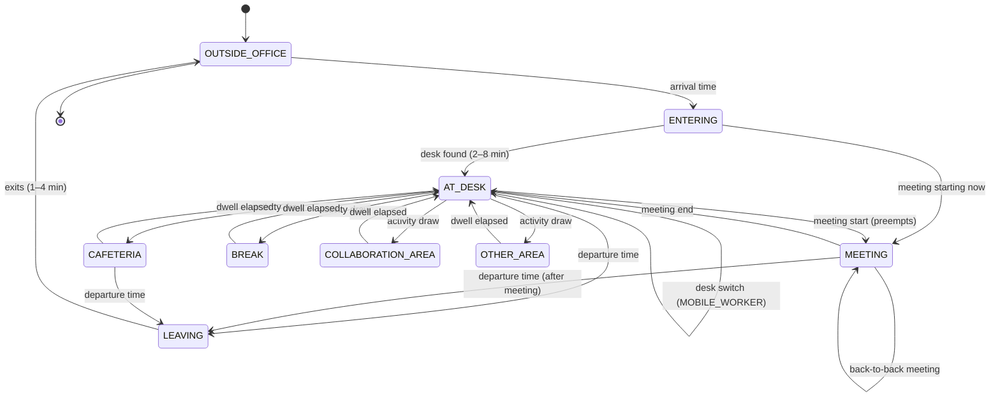

# Simulation Engine

> Status: DRAFT v0.2. Related: `architecture.md`, `event-model.md`, `live-streaming.md`, `simulation-scenarios.md`
> The simulation engine is the core of the system. Everything else consumes what it produces.
>
> **Reference implementation:** `reference/refsim/` implements this design end to end (planner, state machines, desk assignment, meetings, area readers, sensors, environment, BMS, delivery, sinks) and passes the invariant/privacy/reproducibility tests in `reference/tests/`. Port it into `services/simulation-engine` rather than re-inventing it. Differences from this document are listed in §17.

---

## 1. Overview

The engine is a **discrete-event simulation (DES)** of a workplace.

- The world is advanced by processing scheduled events in simulated-time order from a priority queue, not by ticking every employee on a timer.
- The engine maintains **ground truth**: where each person really is and what they are really doing.
- **Observers** turn ground truth into the events each data source would realistically emit, with lag, noise, and failures.
- A **delivery layer** applies transport anomalies and hands events to a sink (event bus in live mode, raw archive in batch mode).

```
┌──────────────────────────── Simulation Engine ────────────────────────────┐
│                                                                            │
│  Clock ──► Scheduler (priority queue) ──► Handlers                         │
│                                             │                              │
│   Day Planner ─────────────────────────────►│                              │
│   (calendar, attendance, arrivals,          ▼                              │
│    meetings, visitors, special events)   World (GROUND TRUTH)              │
│                                          ├─ person state machines          │
│                                          ├─ desk assignment engine         │
│                                          ├─ space occupancy (true counts)  │
│                                          └─ environment physics model      │
│                                             │ truth transitions            │
│                                             ▼                              │
│   Observers: Access │ Workstation │ DeskSensor │ RoomSensor │ EnvSensor    │
│                                             │       ▲                      │
│                                             │       │ observed values only │
│                                             │      BMS (automation rules)  │
│                                             ▼                              │
│                   Delivery: Anomaly Injector ──► Sink (Live | Batch)       │
└────────────────────────────────────────────────────────────────────────────┘
```

---

## 2. Run Modes

| Mode | Clock | Sink | Used for |
|---|---|---|---|
| `LIVE` | `ScaledRealtimeClock` (speed 1x, 5x, 10x, 30x, 60x) | `LiveSink` → EventPublisher | watching the office in the UI |
| `BATCH` | `VirtualClock` (no waiting) | `BatchSink` → RawArchive | historical generation (7/30/90/365 days), tests |

Both modes run the exact same planner, world, observer, BMS and anomaly code. Only the clock and sink differ. This is what makes live and batch output comparable and testable.

---

## 3. Simulated Clock

```python
class Clock(Protocol):
    def now(self) -> datetime: ...                 # current simulated time
    async def wait_until(self, t: datetime) -> None: ...
```

- `ScaledRealtimeClock`: maps wall time to sim time as `sim = sim_anchor + (wall - wall_anchor) * speed`.
  - `PAUSE` freezes the anchor.
  - `SET_SPEED` re-anchors at the current sim time, so speed changes never jump or rewind time.
- `VirtualClock`: `wait_until` returns immediately and sets `now = t`.
- Simulated days run from `00:00` to `24:00` in the building timezone. Nights are mostly empty, so the engine fast-forwards through them in live mode (config `skip_night: true`, default on). Live mode then jumps from the last departure to the next morning's first scheduled event, with only environment ticks at night-time resolution.

---

## 4. Scheduler

A binary heap (`heapq`) of scheduled items:

```python
@dataclass(order=True)
class ScheduledItem:
    time: datetime
    priority: int          # lower runs first at equal time (see table)
    seq: int               # global insertion counter, deterministic tie-break
    kind: ItemKind = field(compare=False)
    target_id: str = field(compare=False)
    token: int = field(compare=False)       # for lazy cancellation
    data: dict = field(compare=False)
```

Main loop:

```
while running:
    item = heap.peek()
    await clock.wait_until(item.time)       # live: sleeps; batch: instant
    apply_pending_control_commands()        # pause/speed/stop between items only
    heap.pop()
    if item.token != current_token(item.target_id, item.kind): continue   # cancelled
    handler[item.kind](item)                # may schedule new items
```

- **Lazy cancellation:** when a person's plan changes (for example a meeting preempts a cafeteria break), their token increments. Stale items are skipped when popped. No heap deletions needed.
- **Priorities at equal timestamps:** control (0), day planning (1), meeting start (2), person transitions (3), observer emissions (4), environment ticks (5), BMS evaluation (6), delivery (7).
- **Item kinds:** `DAY_START`, `DAY_END`, `PERSON_TRANSITION`, `MEETING_START`, `MEETING_END`, `OBSERVER_EMIT` (delayed sensor outputs), `SENSOR_HEARTBEAT`, `ENV_TICK`, `BMS_EVAL`, `DELIVER` (delayed/late delivery), `SENSOR_FAILURE_START`, `SENSOR_FAILURE_END`, `STATUS_SNAPSHOT`.
- Complexity: O(log n) per item. Work is proportional to the number of state changes, not employees × time steps.

---

## 5. Randomness and Reproducibility

- One root seed (`SIMULATION_SEED` or `simulation.yaml: seed`).
- All randomness comes from **named, derived streams**. Nothing calls `random` or `numpy.random` globals.

```python
rng = RngFactory(root_seed)
rng.stream("attendance", date)                   # per day
rng.stream("person", employee_id, date)          # per person per day
rng.stream("sensor_noise", sensor_id, date)
rng.stream("anomaly", date)
rng.stream("observers", date)                    # identity + occupancy observers, delivery delays
rng.stream("environment", date)                  # env physics, BMS, heartbeats (separate so the
                                                 # live 1-min / batch 15-min interval difference
                                                 # never shifts other draws)
```

- Streams are `numpy.random.Generator(PCG64(SeedSequence([root_seed, stable_hash(name), stable_hash(key)...])))`. `stable_hash` is a fixed hash (e.g. xxhash64), never Python's `hash()`.
- Consequences:
  - Adding a new component or employee does not shift the random draws of existing ones.
  - Each simulated day is independently reproducible from `(seed, date)` plus carried-over state (environment end state and multi-day leave). Batch mode can therefore generate days in parallel worker processes, with environment state initialized from a deterministic night-setback baseline.
  - Live and batch runs with the same seed produce the same ground truth and the same observed event content.
- Pause, resume and speed changes do not affect outcomes, because all timing is in simulated time and control commands are applied between items.

---

## 6. Day Planner

Runs at `DAY_START` (00:00 sim) for each simulated day.

### 6.1 Calendar
- Weekends and holidays come from `config/calendar.yaml`. On non-working days, the planner schedules only a small configurable weekend attendance (default 1–3% of office-mode employees) plus environment ticks.

### 6.2 Leave
- A leave rate (default 4% of working days) is drawn per employee-day, with multi-day blocks (1–5 days) for annual leave.
- Leave records are written to the mock SaaS (`leave_record`).
- Employees on leave do not attend.

### 6.3 Attendance (team-correlated)

Each employee gets an attendance probability for the day:

```
p = base(work_mode, planned_mode[weekday])
    × weekday_factor[weekday]
    × team_day_multiplier(team, date)
    × special_event_multiplier
```

| Term | Default |
|---|---|
| `base` OFFICE | 0.92 |
| `base` HYBRID, planned OFFICE day | 0.85 |
| `base` HYBRID, planned REMOTE day | 0.08 |
| `base` HYBRID, FLEX day | 0.35 |
| `base` REMOTE | 0.03 |
| `weekday_factor` Mon..Fri | 0.90, 1.05, 1.10, 1.05, 0.75 |

- **Team correlation:** `team_day_multiplier` is a shared latent draw per team per day, from a log-normal centered at 1.0 (σ configurable, default 0.15). It is higher on the team's configured office days. Teammates therefore come in together more often than independent draws would produce.
- **Calibration:** after computing all `p`, the planner rescales them so the expected attendance matches `attendance.average_daily_percentage` (±tolerance). Attendance is then drawn per employee.
- **Planned vs actual:** `employee_work_pattern` is the plan. Actual attendance deviates from it, which is realistic.

### 6.4 Arrival and departure times

Each behavioral profile (`config/profiles.yaml`) defines distributions:

| Profile | Arrival | Workday length | Notes |
|---|---|---|---|
| `EARLY_BIRD` | N(07:30, 20 min) | N(8.3 h, 40 min) | |
| `STANDARD` | N(09:00, 30 min) | N(8.8 h, 45 min) | |
| `LATE_STARTER` | N(10:30, 30 min) | N(8.8 h, 45 min) | |
| `MEETING_HEAVY` | N(09:00, 25 min) | N(9.0 h, 45 min) | meeting weight × 2 |
| `REMOTE_HEAVY` | N(09:30, 40 min) | N(7.0 h, 60 min) | often shorter office days |
| `MOBILE_WORKER` | N(09:15, 35 min) | N(8.5 h, 50 min) | frequent area changes, desk switching |

- Distributions are truncated to a configured `[earliest_arrival, latest_arrival]` window.
- The mixture of profiles in the employee population produces the aggregate arrival curve in SPEC §6 (very low 06–07, low 07–08, high 08–09, very high 09–10:30, medium 10:30–12). A calibration test verifies the aggregate histogram against the configured target curve.
- **Departure:** `arrival + workday_length`, then adjusted by a departure hazard multiplier that increases after 16:00. It is clamped to `[16:00 - early_leave_allowance, latest_departure]`. A small fraction of employees leave early (configurable, for example appointments).

### 6.5 Meeting plan (MeetingScheduler)

Meetings are planned for the whole day before anyone arrives.

1. Target meetings per attending employee is drawn around `meetings.average_per_employee` and scaled by profile (MEETING_HEAVY × 2).
2. Meetings are created as group events:
   - organizer picked from attending employees
   - participants drawn mostly from the organizer's team (default 70%) and department (20%), the rest from anywhere
   - size drawn from a distribution (2–4 common, 5–10 less common, 10+ rare)
   - start times drawn from a time-of-day weight curve (peaks 10:00–12:00 and 14:00–16:00, none during 12:30–13:30 by default), aligned to 00/30 minutes
   - duration: 30 / 60 / 90 minutes with configurable weights
3. A room is booked with the smallest adequate available capacity on the organizer's floor, then nearby floors. If none is free, the meeting is dropped or moved (configurable).
4. The booking is written to the mock SaaS.
5. **Realism controls:**
   - `no_show_probability` per participant (default 8%)
   - `ghost_booking_probability` per meeting (default 7%): booked, nobody attends
   - `early_end_probability` (default 20%): ends 5–20 min early
   - `late_start_minutes`: N(3, 2)
   - **Walk-in usage** (default 5% of room usage): people use rooms without booking, for ad-hoc meetings

Participants who don't attend that day are automatically no-shows.

### 6.6 Visitors and special events
- The planner fetches special events and visitor registrations for the date from the mock SaaS.
- A special event adds:
  - expected guests as `VISITOR` persons with badge arrivals around the event start
  - an attendance uplift for employees (`expected_employees` translated into a special-event multiplier)
  - reserved rooms (blocked for regular bookings)
  - unavailable desks (removed from assignment)
- Visitor persons follow a simplified state machine: `OUTSIDE → ENTERING → EVENT_SPACE / MEETING / COMMON_AREA → LEAVING`. They never get workspace logins.

### 6.7 Outputs of planning
For each attending person, the planner schedules an arrival `PERSON_TRANSITION` and stores their day plan (meetings, departure target, lunch window preference). For each meeting it schedules `MEETING_START` and `MEETING_END`.

---

## 7. Person State Machine (Ground Truth)

### 7.1 States

| State | Location | Holds desk? |
|---|---|---|
| `OUTSIDE_OFFICE` | none | no |
| `ENTERING` | entrance / circulation | no |
| `AT_DESK` | workspace | yes (seated) |
| `MEETING` | room | holds desk if they logged in earlier |
| `CAFETERIA` | common area (cafeteria) | holds |
| `BREAK` | common area (lounge) or out of sensor coverage | holds |
| `COLLABORATION_AREA` | common area (collaboration) | holds |
| `OTHER_AREA` | anywhere without sensors (restroom, corridors, other floor) | holds |
| `LEAVING` | circulation / entrance | releases at transition |

### 7.2 Person runtime state

```python
@dataclass
class PersonState:
    person_id: str
    person_type: PersonType            # EMPLOYEE | VISITOR
    state: PersonStateEnum
    location_type: LocationType | None # WORKSPACE | ROOM | COMMON_AREA | UNSENSED
    location_id: str | None
    held_workspace_id: str | None      # desk they've claimed today
    inside_building: bool
    current_activity: str | None
    next_transition_time: datetime | None
    token: int                         # lazy cancellation
    day_plan: DayPlan                  # meetings, target departure, flags
    lunch_taken: bool
```

### 7.3 Transitions



Any non-desk state can also go directly to another non-desk state (for example `MEETING → CAFETERIA`), controlled by the activity model.

### 7.4 Activity model (next state and dwell)

When a person finishes a dwell at their desk, the engine draws:
1. **Time until the next move away from the desk**, from an exponential distribution whose rate is modulated by time of day and profile.
2. **Which activity**, from weights modulated by time of day.
3. **Dwell duration** in that activity, from a log-normal distribution per activity.

Default time-of-day weight modifiers (multiplicative on base weights):

| Window | CAFETERIA | BREAK | COLLABORATION | OTHER | Leave-desk rate |
|---|---|---|---|---|---|
| 07:00–10:00 | 0.6 | 0.8 | 0.8 | 1.0 | 0.8 |
| 10:00–12:00 | 0.5 | 1.0 | 1.2 | 1.0 | 1.0 |
| 12:00–14:00 | **4.0** | 1.2 | 0.6 | 1.0 | 1.5 |
| 14:00–16:00 | 0.8 | 1.3 | 1.2 | 1.0 | 1.0 |
| 16:00–20:00 | 0.7 | 1.0 | 0.8 | 1.0 | 0.9 |

Default dwell durations (log-normal, median / p90):

| Activity | Median | P90 |
|---|---|---|
| Desk block between moves | 45 min | 110 min |
| CAFETERIA (lunch) | 35 min | 55 min |
| CAFETERIA (coffee, outside lunch) | 10 min | 20 min |
| BREAK | 8 min | 18 min |
| COLLABORATION_AREA | 25 min | 60 min |
| OTHER_AREA | 5 min | 12 min |

Constraints:
- **Lunch:** at most one long cafeteria visit per day (`lunch_taken`). A person without lunch by 14:00 has a strongly increased lunch probability. A configurable fraction skip lunch or eat at their desk.
- **Meeting preemption:** at `meeting_start - travel_time(1–3 min)`, each participant (not a no-show) is pulled into `MEETING`. Their current activity is cancelled via token. If they haven't arrived yet, they may join late or become a no-show.
- **Departure preemption:** at the target departure time, a person in a meeting finishes the meeting first. Otherwise they transition to `LEAVING`. A short desk return before leaving (to pack up) happens with high probability.
- **MOBILE_WORKER** has a desk-switch probability per desk block: the person releases the held desk and claims another one (producing a logout/login pair).

All numbers live in `config/profiles.yaml` and `simulation.yaml`. None are hardcoded.

---

## 8. Desk Assignment Engine

Triggered when a person enters `AT_DESK` without a held desk.

**ASSIGNED floors:** use `workspace_assignment`. If the assigned desk is unavailable (marked unavailable, or blocked by a special event), fall back to the hot-desk algorithm.

**HOT_DESK floors:** search in order:
1. preferred zone
2. the team's allocated zones (`team_zone_allocation`)
3. any zone on the home floor
4. other floors, nearest first
5. overflow: collaboration area (no workspace login)

Within a zone, desk choice is weighted by:
- familiarity (the person's desk from their last visit gets a higher weight, which produces realistic "favorite desk" patterns)
- proximity to teammates already seated

A desk is **claimed** from the moment a person first sits until they log out, switch, or leave. Claimed desks are not offered to others, even while the owner is away. This produces the realistic "logged in but vacant" pattern.

When steps 1–4 fail, the engine emits `TRUTH_DESK_SEARCH_FAILED`. Observable consequence: no workspace login, overflow area occupancy.

---

## 9. Observers

Observers subscribe to ground-truth transitions via an in-process bus. They output observed events into the delivery layer. **Observers can read ground truth, but they only emit what their device could physically know.**

### 9.1 AccessControlObserver
- `ENTERING` → `ACCESS_IN` at the person's entrance, event time = transition time + N(10 s, 5 s).
- `LEAVING → OUTSIDE_OFFICE` → `ACCESS_OUT`.
- `tailgate_probability` (default 1.5%): the `ACCESS_IN` is not emitted.
- `missed_badge_out_probability` (default 4%): the `ACCESS_OUT` is not emitted.
- Visitors use `VISITOR_BADGE` credentials.
- Generates the visit `correlation_id` used by the workstation observer for the same person-visit.

### 9.1b Internal access readers and room panels
- Readers are placed by the layout: a lobby reader per floor above ground, a secure-zone reader per restricted zone, door readers on configured room types.
- On every ground-truth move, the observer checks which readers the path crosses:
  - destination floor ≠ current floor → destination floor lobby reader
  - destination is a room with a door reader → that reader
  - destination zone is restricted and differs from the current zone → secure-zone reader
- Each pass emits `AREA_ACCESS` with a few seconds' offset (multiple readers on one path are spaced ~20 s apart). Non-secure readers respect `internal_badge_compliance`.
- Restricted zones are excluded from desk search for teams not in `zone_access_rule`.
- **Room panel:** when a meeting starts and the organizer is present, `ROOM_CHECK_IN` is emitted 30–180 s later with probability `room_check_in_probability`.

### 9.2 WorkstationObserver
- First arrival at a claimed desk → `WORKSPACE_LOGIN` after a login delay of N(60 s, 30 s).
- Desk switch → `WORKSPACE_LOGOUT(SWITCH)` then `WORKSPACE_LOGIN`.
- Leaving → `WORKSPACE_LOGOUT(EXPLICIT)` with `explicit_logout_probability` (default 70%).
  - Otherwise the session ends later by `TIMEOUT` (idle policy, default 2 h after the desk was last truly occupied) or by `END_OF_DAY` sweep (default 23:00).
- `no_login_probability` (default 3%): the person works at a desk without logging in (laptop only).

### 9.3 DeskSensorObserver
Models a PIR under-desk sensor with debounce. Per desk it keeps `true_occupied` and `reported_status`.
- **Detection delay** (vacant → occupied): N(30 s, 15 s).
- **Hold time** (occupied → vacant): the sensor reports vacant only after `vacancy_timeout` (default 3 min) of no presence.
- **Stillness dropout:** while truly occupied, short false-vacant flickers occur at a configurable rate (default 0.2 per occupied hour). These are subject to the same hold logic, so most are suppressed.
- **False positive:** a rare false-occupied blip (default 0.02 per vacant hour).
- Emits `OCCUPANCY_CHANGED` on change of reported status. Heartbeats run on their own schedule.

### 9.4 RoomSensorObserver
Covers meeting rooms and common areas.
- Tracks the true count per room from ground truth.
- The reported count lags truth by N(20 s, 10 s).
- Count noise: ±1 error with configurable probability, higher for larger counts and for auditoriums/common areas.
- Emits `ROOM_OCCUPANCY_CHANGED` when the reported count changes. Rapid changes are batched within a `min_report_interval` (default 15 s).

### 9.5 EnvironmentSensorObserver and physics model
An environment state is kept per HVAC zone and updated on `ENV_TICK` (live: every `environment_poll_interval`, default 60 s; batch: default 15 min per SPEC §51.11).

Per metric:

| Metric | Model |
|---|---|
| Temperature | Ornstein-Uhlenbeck toward a target: `target = hvac_setpoint(mode) + occupancy_heat × occupants/area + outdoor_influence(t)`. Mean reversion θ depends on HVAC mode (HIGH > NORMAL > ECO). Noise σ ≈ 0.05 °C per tick, hard bounds 16–32 °C. Produces smooth series (23.1, 23.2, 23.2, 23.4…). |
| CO2 | Mass balance: `dCO2 = generation × occupants / volume − ventilation_rate(mode) × (CO2 − outdoor_co2)`, plus small noise. Floor at ~420 ppm. |
| Humidity | OU around a seasonal baseline, weakly coupled to occupancy. |
| Light | Schedule: lights on (≈400–500 lux) when occupied or during core hours, plus a daylight curve for window zones. Off (≈5 lux) otherwise. |
| Noise | Baseline 35 dBA + log-scaled function of occupants + noise. |

- The outdoor temperature curve is a configurable daily sinusoid with seasonal offset. No external weather source is used in v1.
- Sensors report the zone state plus small measurement noise and rounding (0.1 °C, 1 ppm, 0.1 %).
- Night setback: the HVAC schedule and ECO mode let temperature drift toward the outdoor-influenced baseline overnight.

### 9.6 Heartbeats and failures
- Each sensor schedules `SENSOR_HEARTBEAT` at its poll interval, with a small per-sensor phase offset so heartbeats don't all fire at the same instant.
- Sensor failures are scheduled by the anomaly module (`SENSOR_FAILURE_START/END`). While failed, the sensor emits nothing. The gateway emits `SENSOR_STATUS_CHANGED(OFFLINE)` after the missed-heartbeat threshold, and `ONLINE` on recovery.

---

## 10. BMS Automation

- Runs on `BMS_EVAL` every `bms.evaluation_interval` (default 1 sim minute).
- Reads only an `ObservedStateView`, a read-only projection of the latest outputs of the sensor observers (occupied desks, room counts, zone environment readings, sensor online status). It has no access to ground truth; this is enforced by the type it receives.
- Rules come from `config/automation_rules.yaml`:

```yaml
rules:
  - rule_id: HVAC_ECO_WHEN_EMPTY
    when: zone_observed_occupancy == 0
    for_minutes: 15
    action: SET_HVAC_MODE
    params: { mode: ECO }
  - rule_id: HVAC_HIGH_WHEN_BUSY
    when: zone_observed_occupancy_pct > 70
    action: SET_HVAC_MODE
    params: { mode: HIGH }
  - rule_id: COOLING_WHEN_HOT
    when: temperature > 25.0 and zone_observed_occupancy > 0
    action: ADJUST_SETPOINT
    params: { delta_c: -1.0, min_setpoint_c: 21.0 }
  - rule_id: VENTILATE_ON_CO2
    when: co2 > 1000
    action: INCREASE_VENTILATION
    params: { level: HIGH }
```

- **Hysteresis and cooldown:**
  - each rule has an exit condition (e.g. leave HIGH when occupancy < 55%)
  - each rule has a `cooldown_minutes` (default 10) to prevent flapping
  - when rules conflict, rule order is the priority
- Every decision emits an `AUTOMATION_ACTION` event. The action updates the zone's HVAC state, which feeds back into the physics model on the next `ENV_TICK`.
- When sensor data is missing (sensor offline), rules treat occupancy as unknown and do not fire ECO. This is a safe default and a useful data-quality demonstration.

---

## 11. Delivery Layer and Anomalies

All observed events pass through the `AnomalyInjector` before reaching the sink. Ground truth is never modified.

| Anomaly | Config key (default) | Behavior |
|---|---|---|
| Duplicate | `duplicate_event_probability` (0.002) | the same envelope (same `event_id`) is delivered again 0–120 s later |
| Late | `late_event_probability` (0.01) | `ingest_time = event_time + LogNormal(median 10 min)`, delivered at that time |
| Out-of-order | `out_of_order_probability` (0.005) | the event is swapped with a later event of the same stream within a 30 s window |
| Missing | `missing_event_probability` (0.001) | the event is dropped (sensor events only; identity events use the observer-level realism in §9) |
| Sensor failure | `sensor_failure_probability` (0.005 per sensor-day) | the sensor goes offline for LogNormal(median 2 h) |
| Partial env failure | `env_metric_null_probability` (0.002) | one metric in a reading is `null` |

- Normal delivery: `ingest_time = event_time + small transport delay` (N(1 s, 0.5 s)).
- Delayed delivery is implemented as `DELIVER` items in the same scheduler, so late events are deterministic and reproducible.
- **Phase rule:** all anomaly probabilities default to 0 until the data-quality phase (SPEC §51.12). The mechanism exists from Phase 4 but stays disabled.

### Sinks
- `LiveSink`: batches events (up to 500 or 100 ms wall time) and calls `EventPublisher.publish`. Truth events go to `ev.truth`.
- `BatchSink`: writes JSONL files directly in the raw archive layout, partitioned by `ingest_time`, with manifests.
- `InMemorySink`: used for tests.

---

## 12. Control and Status

### Engine lifecycle

```
STOPPED ──START──► RUNNING ──PAUSE──► PAUSED ──RESUME──► RUNNING
   ▲                  │                  │
   └──────STOP────────┴──────STOP────────┘
RESET (any state) → STOPPED with world cleared, new run on next START
```

- `START {sim_date, speed, config_id?, seed?}`:
  - creates a `simulation_run` row
  - loads master data
  - runs the day planner
  - begins the loop
- `STOP`: finalizes the run (status `STOPPED`) and flushes sinks. Open sessions are not closed, which matches reality mid-day.
- `RESET`:
  - stops the run
  - clears engine memory
  - publishes `SIMULATION_LIFECYCLE(RUN_STOPPED)` so the processor clears current state for that run
- `GENERATE_HISTORY {days, end_date?}`: starts a separate BATCH run in worker processes. It can run while no live run is active (v1 constraint: one active run at a time).
- Status snapshot on `sim.status` every 1 s wall time:
  - state, sim time, speed
  - events generated (by type)
  - true employees inside, occupied desks, occupied rooms (engine-side counters, labeled "simulation truth" in the control panel)
  - runtime

---

## 13. Master Data Generation

Separate from the runtime engine. It runs once per configuration and seed (`generate-master-data` command, and automatically on first start).

| Generator | Output |
|---|---|
| `LayoutLoader` | buildings, floors, zones, desks, rooms, common areas, access points from `config/layouts/*.yaml` |
| `SensorGenerator` | one desk sensor per desk with `has_sensor` (coverage % configurable), one count sensor per room and common area, one environment sensor per zone |
| `OrgGenerator` | departments, teams (sizes from a configurable distribution), team home floors and zone allocations proportional to floor capacity |
| `EmployeeGenerator` | employees with names (from a bundled name list, seeded), emails, roles, managers (tree per team), work modes (configurable mix, default OFFICE 25% / HYBRID 60% / REMOTE 15%), profiles (configurable mix), preferred zones |
| `WorkPatternGenerator` | weekly planned modes for hybrid employees, biased toward team office days |
| `AssignmentGenerator` | desk assignments for ASSIGNED floors |

Layouts can be hand-written YAML or produced by a `LayoutGenerator` for scale presets (small/medium/large: grid of zones with desk blocks and rooms per floor).

---

## 14. Testing Strategy

**Unit tests**
- Clock arithmetic (speed changes, pause).
- Scheduler ordering and tie-breaks, lazy cancellation.
- Each observer, with scripted truth sequences (e.g. sit 10:00 → leave 10:26 → sensor vacant at 10:29 with default hold time).

**Invariant / property tests** (run over a full simulated day at small scale):
- Every person's truth sequence starts and ends at `OUTSIDE_OFFICE`, and no one is in two places at once.
- No true room count exceeds capacity × `overflow_tolerance`.
- Every `WORKSPACE_LOGIN` happens while the person is truly inside.
- No ANONYMOUS event contains a person identifier (envelope validator plus a scan of all payload values).
- With anomalies disabled: every emitted event has `ingest_time - event_time < 5 s`, and there are no duplicates.

**Statistical calibration tests** (tolerance-based, fixed seed, medium scale):
- Daily attendance within ±3 percentage points of `average_daily_percentage` over 20 working days.
- Arrival histogram matches the target curve (e.g. Jensen–Shannon distance below a threshold).
- Meetings per attending employee within ±10% of config.
- Teammate attendance correlation is higher than for random employee pairs.

**Reproducibility tests**
- Same seed and config, two batch runs of one day: identical content hash of the observed events (excluding `event_id` and `simulation_run_id`).
- A live run at 60x speed and a batch run of the same day produce the same content hash.

**Performance targets** (medium scale: 1,000 employees, 800 desks, 50 rooms, 40 zones)
- One simulated day in batch mode: < 30 s on a developer laptop (single process).
- 365 days in batch mode: < 30 min using parallel day workers.
- Live mode at 60x sustains real-time without falling behind. Scheduler lag is exposed as a metric.

---

## 15. Expected Event Volumes (medium scale, per working day, 65% attendance)

| Event type | Approx. per day | Driver |
|---|---|---|
| ACCESS_IN / OUT | ~1,300 | 650 people × 2 |
| WORKSPACE_LOGIN / LOGOUT | ~1,400 | plus desk switches |
| OCCUPANCY_CHANGED | ~12,000 | ~9 desk transitions × 2 × 650, plus flicker |
| ROOM_OCCUPANCY_CHANGED | ~15,000 | meeting joins/leaves and common-area traffic |
| SENSOR_HEARTBEAT | ~245,000 | 850 sensors × 288 (5-min interval) |
| ENVIRONMENT_READING (live, 1 min) | ~57,600 | 40 zones × 1,440 |
| ENVIRONMENT_READING (history, 15 min) | ~3,840 | 40 zones × 96 |
| AUTOMATION_ACTION | ~200–500 | |
| TRUTH_* | ~12,000 | |

- Heartbeats dominate. Their interval is configurable and they can be disabled in batch mode (`batch.emit_heartbeats: false`, default false) to keep a 365-day history around **~9 M operational events plus ~3 M truth events**.
- Environment and heartbeat volume grows linearly with sensors, not with employees.

---

## 16. Configuration Reference (sketch)

```yaml
# config/simulation.yaml
seed: 12345
timezone: Asia/Kolkata
scale_preset: medium            # small | medium | large | custom

office:
  layout_files: [layouts/building_a.yaml]

employees:
  count: 1000
  work_mode_mix: { OFFICE: 0.25, HYBRID: 0.60, REMOTE: 0.15 }
  profile_mix: { EARLY_BIRD: 0.12, STANDARD: 0.45, LATE_STARTER: 0.12,
                 MEETING_HEAVY: 0.13, REMOTE_HEAVY: 0.08, MOBILE_WORKER: 0.10 }

simulation:
  speed: 30
  skip_night: true
  core_hours: { start: "08:00", end: "18:00" }

attendance:
  average_daily_percentage: 65
  team_correlation_sigma: 0.15
  weekday_factor: { MON: 0.90, TUE: 1.05, WED: 1.10, THU: 1.05, FRI: 0.75 }
  leave_rate: 0.04

meetings:
  average_per_employee: 2.3
  no_show_probability: 0.08
  ghost_booking_probability: 0.07
  walk_in_share: 0.05

sensors:
  desk_poll_interval: 300
  room_poll_interval: 300
  environment_poll_interval: 60
  desk_vacancy_timeout_s: 180
  desk_sensor_coverage: 1.0

batch:
  environment_poll_interval: 900
  emit_heartbeats: false
  parallel_workers: 4

bms:
  evaluation_interval_s: 60

anomalies:                        # all 0 until the data-quality phase
  duplicate_event_probability: 0.0
  late_event_probability: 0.0
  out_of_order_probability: 0.0
  missing_event_probability: 0.0
  sensor_failure_probability: 0.0
```

---

## 17. Reference Implementation Notes (`reference/refsim`)

| Area | Reference behaviour | Production target |
|---|---|---|
| Time | float seconds since run start date midnight; ISO with building offset | same, wrapped in a `Clock` protocol |
| Live clock | `server.py` Runner: scaled clock, night skip, pause/speed/reset | engine service + Redis control channel |
| Sinks | Archive (JSONL + manifests), Stdout, Callback, RedisStream (optional) | EventPublisher adapters |
| Processor | `state.py` LiveState (dedupe, event-time guards, KPIs, change log) | event-processor service + Redis |
| Visitors / special events | not implemented | Phase 10 (scenarios) |
| Walk-in meetings, late joiners | not implemented | optional realism, Phase 9 |
| Desk choice | favourite desk (60%) else random in zone | add teammate-proximity weighting |
| Stillness flicker / false positives on desk sensors | not implemented | Phase 9 (data quality) |
| Sensor failures, out-of-order | not implemented (duplicate, late, missing are) | Phase 9 |
| Arrival curve | profile mixture; 10:00–12:00 slightly under the SPEC §6 shape | tune `profiles` / `profile_mix`, keep the calibration test |

Performance measured in the sandbox: medium scale (1,000 employees, 800 desks) ≈ 2 s per simulated day in batch mode (single process), ≈ 115 k observed events + 64 k truth events per 7 days with heartbeats off.
